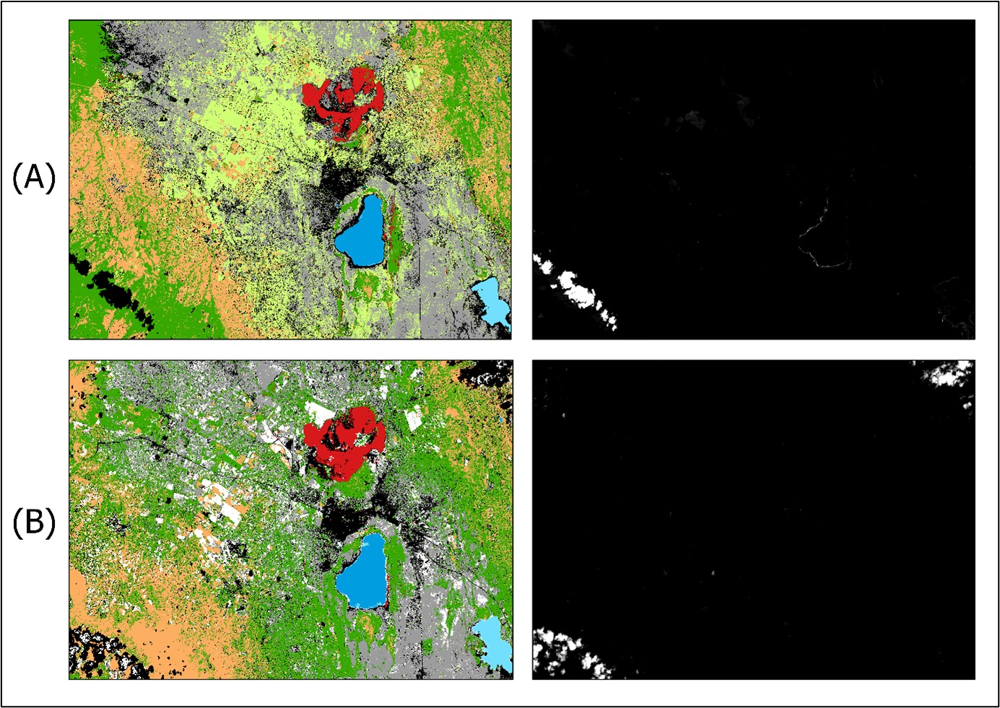

_This is the first in a three part series telling the  story of Nakuru's urban expansion using different technologies. Part 1 looks at the most basic kind of medium, a timeseries of thematic maps distributed like most traditional cartographic product in the form of static images. The tools used here are, unfortunately, for-pay though Parts 2 and 3 will then turn towards Google Earth Engine (free) and some of my favourite interactive visualisation libraries in the Python ecosystem (free and open-source)._

This first installment shamelessly rehashes my very first assignment from college days where I chose to examine the incredible urban expansion of Nakuru, Kenya, between 2002 and 2020, as emblematic of many second and third tier cities in the Global South. These are the places where most of the future urban growth [is projected](https://www.un.org/development/desa/publications/2018-revision-of-world-urbanization-prospects.html) to take place. At the same time, these are the places which [urban research](https://onlinelibrary.wiley.com/doi/10.1111/j.1468-2427.2009.00886.x) in general and [urban remote sensing studies](https://www.sciencedirect.com/science/article/abs/pii/S0034425720301097) in particular consistently bypass.

Having spent close to three wonderful years in Kenya, with fond memories of Nakuru and its stunning surroundings in particular, I was keen to take a closer look at how exactly this vibrant second-tier city developed during these crucial two decades.

So let's get started.

- [Getting the data](#getting-the-data)
- [Layer Stacking and Subsetting](#layer-stacking-and-subsetting)
- [First visual explorations](#first-visual-explorations)
- [Collecting and merging signatures](#collecting-and-merging-signatures)
- [Cleaning up](#cleaning-up)
- [Final output and analysis](#final-output-and-analysis)

### Getting the data

As we will be working with Landsat data, we first need to create an account at [USGS Earth Explorer](https://earthexplorer.usgs.gov/). The same account can be used for [USGS GloVis](https://glovis.usgs.gov/app) which has a slightly more userfriendly interface and is a great alternative whenever Earth Explorer is down.

For this supervised land cover classification, I used scenes from **three different Landsat satellites**: [Landsat 7 ETM+ for 2002](https://dds.cr.usgs.gov/download/eyJpZCI6MjUzNjU3NTcsImNvbnRhY3RJZCI6MjQ0NTY0MzN9/), [Landsat 5 TM for 2011](https://glovis.usgs.gov/scene/view/landsat_tm_c1/LT51690602011257MLK00/) and [Landsat 8 OLI for 2020](https://dds.cr.usgs.gov/download/eyJpZCI6MjUzNjYzMDksImNvbnRhY3RJZCI6MjQ0NTY0MzN9/). Due to the [Scan Line Correction failure](https://www.usgs.gov/core-science-systems/nli/landsat/landsat-7?qt-science_support_page_related_con=0#qt-science_support_page_related_con) of L7 post-2003, the 2011 scene was unfortunately not usable, hence L5 was chosen as the fallback option.

There are plenty of tutorials out there on Earth Explorer but here a quick rundown of how to get at these images or 'scenes': In the EE **Search Criteria** tab, select **World Features** and enter 'Nakuru' in the **Feature Name** text box, then click **Show**. Finally, click on 'Nakuru' in the results section appearing below. The map will focus on Nakuru. Enter a date range you're interested in and hit the **Data Sets** button. On this tab, you have a range of collections to choose from. With regards to Landsat, scenes in [Collection 1 Level 1](https://www.usgs.gov/core-science-systems/nli/landsat/landsat-collection-1?qt-science_support_page_related_con=1#qt-science_support_page_related_con) have been preprocessed and georeferenced to the highest standard and are best suited for time series analyses, so choose this one. On the **Additional Criteria** tab, it's not a bad idea to select a **Land Cloud Cover** of at most **Less than 20%**. Once you've found a scene you like (there is a preview option) and clicked the download button, select **Level-1 GeoTIFF Data Product**.

Once you've downloaded your scenes, unzip the respective `.tar.gz` files (for some scenes, this involves first unzipping the `.tar.gz`, and then a `.tar` inside the newly unzipped folder).

### Layer Stacking and Subsetting

I will only outline the most essential steps in this supervised land cover classification, since other software packages will have slightly varying workflows and terminologies. Image enhancement, for instance, will be skipped entirely.

Satellites differ significantly in the range of the electromagnetic spectrum they're interested in, their radiometric and ground resolution as well as a host of other metrics. The sensor on-board the Landsat 7, for instance, is the [Enhanced Thematic Mapper Plus (ETM+)](https://www.usgs.gov/core-science-systems/nli/landsat/landsat-7?qt-science_support_page_related_con=0#qt-science_support_page_related_con) covering 8 spectral bands, from Band 1 with the Visible Blue (wavelengths of 0.45 - 0.52 µm) to Band 7 with Mid-Infrared (2.08 - 2.35 µm) and finally a panchromatic Band 8.

That's why the zipped files you downloaded contained multiple `TIF` files, each representing one of these bands. Before we can dive into classification, these need to be **'stacked'** on top of each other in the correct order into a multispectral image. In ERDAS IMAGINE, this is done via the **Raster** tab, **Spectral** icon and then **Layer Stack**.

Next, it's a good idea to clip our scenes to only the study area we're interested in. In ERDAS, this is done by drawing an **Inquire Box** via the **Home** tab and the **Inquire** drop-down. You can then head over to the **Raster** tab, select **Subset and Chip**, then **Create Subset Image** and select **From Inquire Box**.

### First visual explorations

Once your stacked and subset image is saved (for ERDAS, as an `.img`), the real fun starts. With monitors working with only a red, green and blue channel, and us having more than three bands to choose from, the art of interpreting imagery is to assign these three channels to different bands which will produce color effects that can help you in more intuitively identifying features based on what you know about how different surfaces reflect different wavelengths of the electromagnetic spectrum.

To see a true color composite with Landsat data, for instance, assign Band 3 to the red channel, Band 2 to green, and Band 1 to blue (in ERDAS, this is done via the **Raster Options** tab). This is the 3-2-1 band combination. A sure-fire way to identify healthy vegetation is to create a False Color Infrared (IR) image by choosing a 4-3-2 band combination where the near-infrared band (Band 4) is assigned to your monitor's red channel. Healthy vegetation absorbs most of the visible light, but reflects a significant portion of near-infrared light. Since this is the portion of the EM spectrum we assigned to our monitor's red channel, healthy vegetation will be indicated in bright red on a false color IR image.

For this particular land cover classification, I primarily worked with **4-3-2** and a second band combination I found helpful for identifying urban areas in various shades of light blue: **4-5-3** for L5 and L7, and **5-6-4** for L8.

But how do we go about turning what we think we see into a neatly categorised thematic map? This is where the 'supervised' part of this classification method comes in.

### Collecting and merging signatures

Each pixel in our image comes with its own spectral signature, with each band yielding a different response depending on the surfaces in question. To teach the computer what is what, we first need to collect **training signatures** and assign these a label we understand. In ERDAS IMAGINE, the **Region Growing** method I found to be the most accurate and efficient, though initially I also drew polygons manually around the land cover types I thought I could accurately identify.

Here we first create an **Area of Interest**. In the **Drawing** tab, in the **Insert Geometry** group, click on the drop-down next to **Grow** which will 'grow' a region originating from a 'seed' pixel). Then click **Growing Properties**. Select the 8 pixel 'neighbourhood' and leave the other settings as is. Click on the **Grow** button again and click on an area of the image which you think contains a homogenous land cover type. A polygon will appear (you may have to zoom in to see it), covering all nearby pixels which ERDAS thinks have a similar spectral profile. You can increase the **Spectral Euclidean Distance** in the **Growing Properties** if you think the area covered by the polygon should be greater.

Once you have your AOI, head to the **Raster** tab, and, in the **Classification** group, click on **Supervised** and select **Signature Editor**. The third icon from the left allows you to **Create New Signature(s)** from an AOI. Under **Signature Name** you can then label your information class as 'urban', 'natural vegetation', 'water' or whichever land cover type your AOI currently covers. For classifications to be robust, the more signatures you have for each land cover type, the better. For this particular classification, I initially collected around 10 for very homogenous classes such as Lake Nakuru or the nearby soda lake, Lake Elementita, and 20 or more for more heterogenous classes such as urban or cropland. The **Display Mean Plot** feature of the Signature Editor helps you insure that all signatures belonging to the same information class have *some* variation but not too much, i.e. containing no majour outliers. ERDAS also offers various statistics overviews to ensure that there is sufficient variability *between* classes and not too much overlap, which is what we want.

Once you're done collecting, highlight all signatures belonging to the same class and click on **Merge Selected Signatures**, which will add a 'composite' signature in the last row, allowing you to delete the individual input signatures at the top. Do this for all information classes. For my first round classification, I settled on the following eight information classes (number of signatures in parenthesis), as some of Nakuru's natural features made for very distinct spectral signatures:

1.	Urban (20)
2.	Natural vegetation (20)
3.	Crops (20)
4.	Fallow fields (15)
5.	Bare soil (15)
6.	Lake Nakuru (10)
7.	Lake Elementita  (10)
8.	Menengai Crater  (10)

Finally, click on **Classify** in the Signature Editor to run your classification based on the composite signatures you merged. There are different probablistic algorithms you can select here, called **parametric rules**, based on which a pixel is assigned to one class as opposed to another. For this classification, I chose the **Maximum Likelihood** approach.

You can also choose to create grey-scale **distance images** in the process which will indicate where your classification may be off or where your current information classes do not cover the full range of spectral profiles. Below you can see my first round classification for the 2002 (A) and 2011 (B) scene along with their respective distance images. 

In the distance images, you can see that cloud cover seems to be the only spectral profile I had missed in my choice of information classes. Comparing the two images from 2002 and 2011, you can also see a fairly muddled and somewhat improbable spatial assignment of information classes (though this is a subjective assessment). As signatures are collected for each scene separately, my choice of AOIs may not have been very consistent across scenes. On the other hand, there definitely *was* also a significant degree of land cover change during that period, though in this case it is, except for the obvious urban expansion (in black), difficult to make out immediately.

For my second and final round, I decided to go at this with a bit more diligence.

### Cleaning up

For round 2, I chose to increase the number of signatures per class, be more consistent across scenes in how I chose AOIs, more diligently compare profile variability before merging signatures, and rely much more on the region growing method rather than drawing AOIs manually.

I also felt that eight land-based information classes would probably visually overwhelm most observers and fail to tell a clear story of Nakuru's urban expansion. I therefore decided that, once the 8-class long-list of land cover types had been assigned, I would **recode** 'crops', 'fallow fields' and 'bare soil' into a composite 'non-urban' information class. In ERDAS, you can do this via the **Thematic** tab and the **Recode** icon which brings you to the Recode Cell Array.

Finally, I applied a 3x3 majority filter to make the urban sections stand out more and reduce noise overall.

| Without majority filter | With majority filter |
|-------------------------|----------------------|
|||

### Final output and analysis

And here are the fruits of our labour.

Though at the cost of being able to present a 'complete' picture of land cover changes, the key message on urban expansion comes across much more clearly than in round 1 and is not obstructed by too many colors and land cover types to keep straight. While the 2020 map does contain a small number of areas in the vicinity of Menengai Crater, primarily fallow agricultural land, which were misclassified as urban, this timeseries now speaks a very clear language. In addition to the visuals, though, let's also look at the numbers, by converting the respective pixel counts to land area, based on Landsat's 30m ground resolution (i.e. 900m²/pixel):

We find an increase in the total land area classified as urban of 130% between 2002 and 2011, and 53% between 2011 and 2020. In total, **the extent of Nakuru’s urban core increased by about 300% to 213km² over the period from 2002 to 2020**. 

A significant portion of the additional urban extent constitutes **ribbon development along traffic arteries** both east of Lake Nakuru National Park as well as along the A104 north-west of Nakuru. **Dispersed low density satellite settlements** have also seen substantial growth throughout Nakuru’s peri-urban and rural hinterland, 

At the same time, land cover associated with **natural vegetation**, excluding agricultural fields, **decreased by 16% and 4%** over the two 9-year periods, respectively. The land area classified as non-urban, including agricultural fields, decreased by 6% over each 9-year period, indicating that **agriculture is competing directly with urban land uses**.

Thoughts, critique or encouragement? All are equally welcome :)

